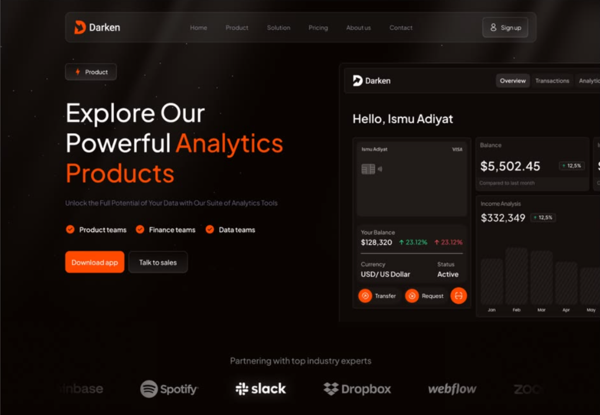
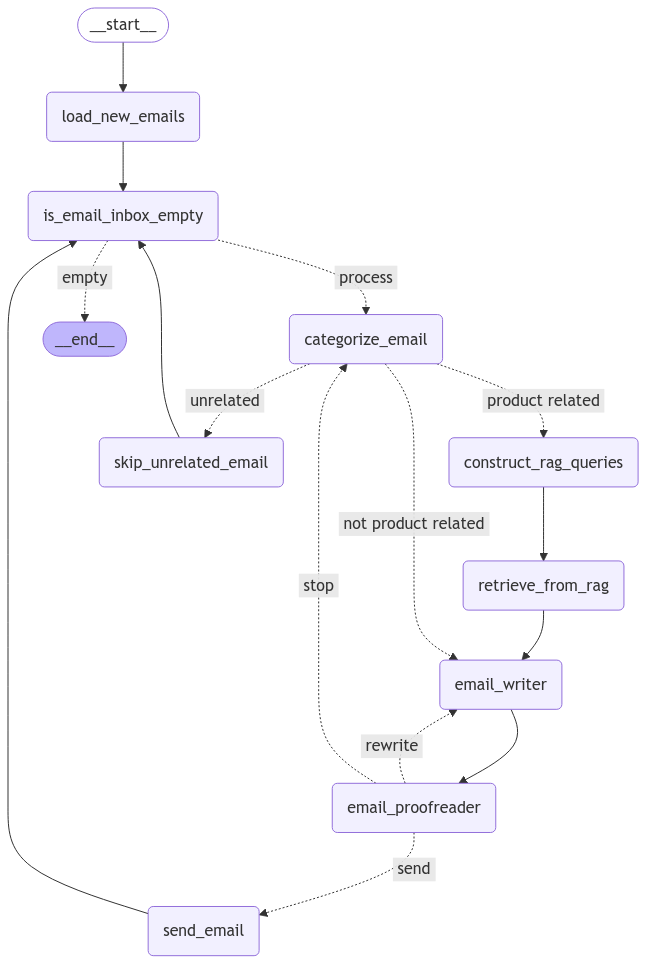
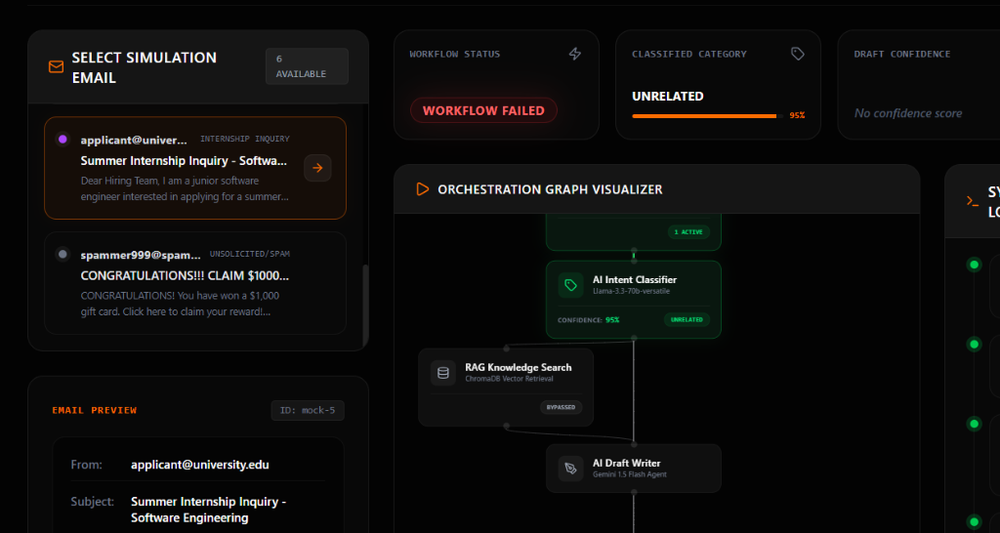
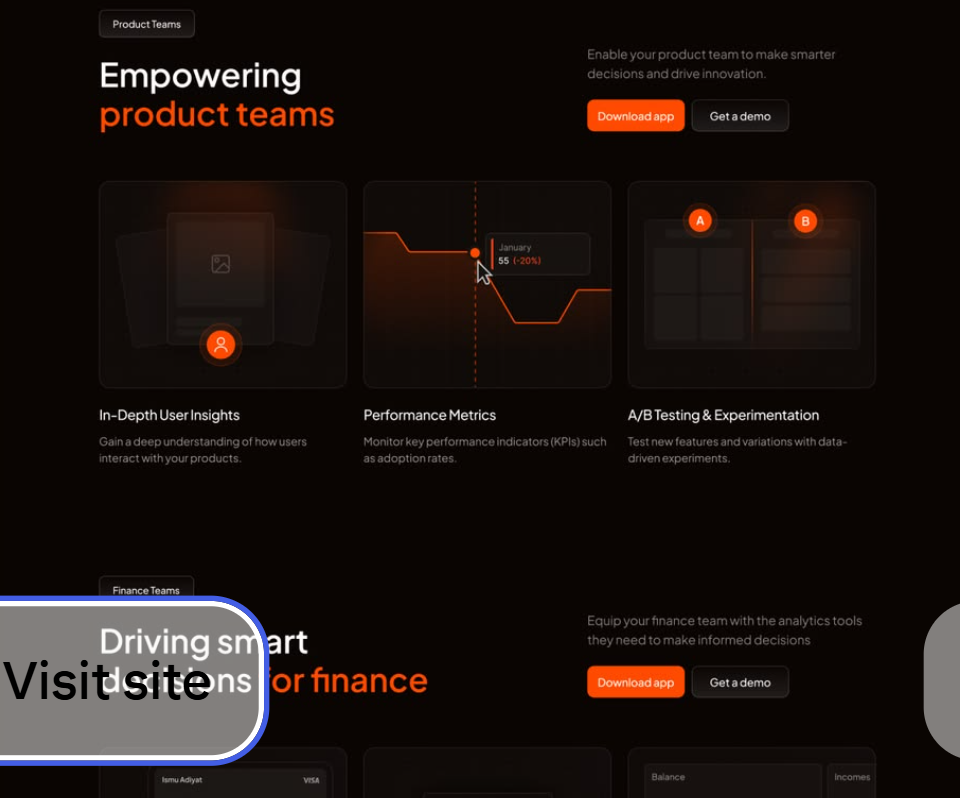
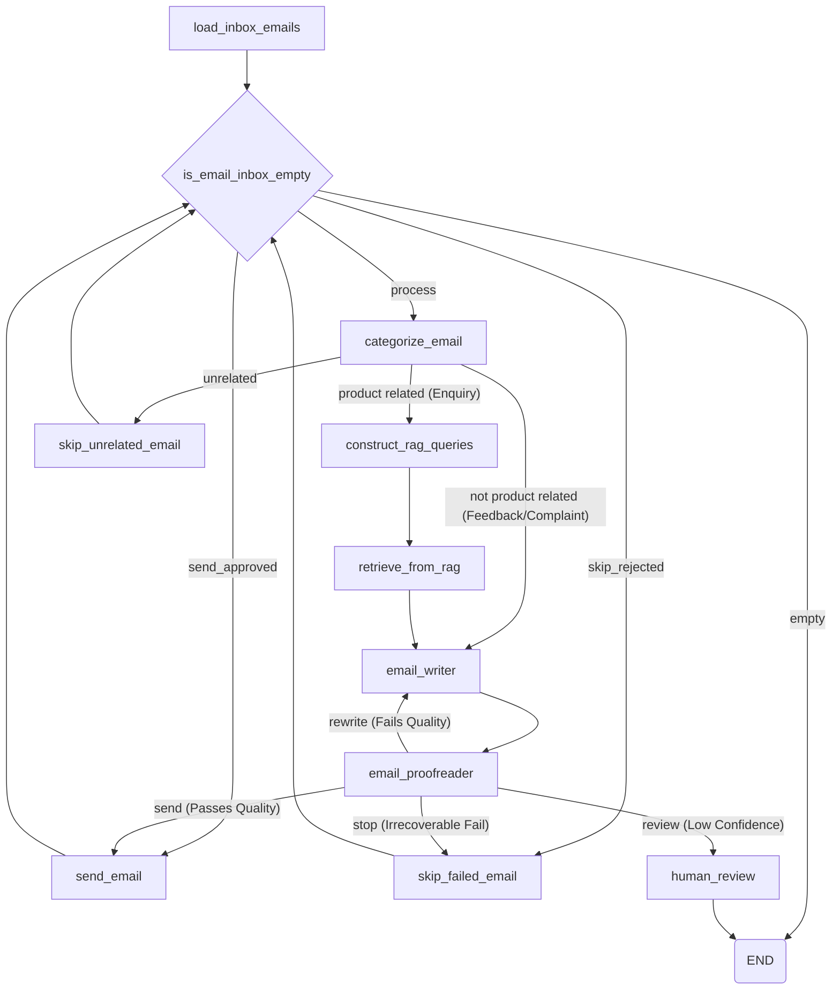
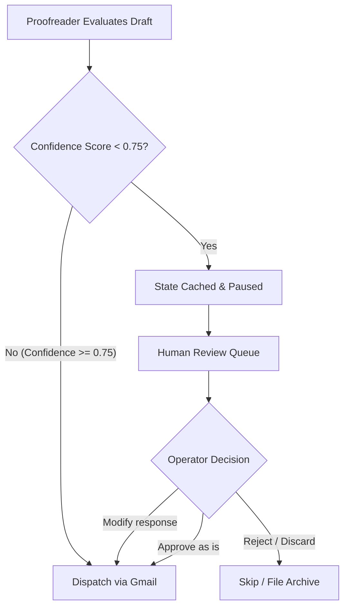

# Observable AI Workflow Automation System

An enterprise-grade email orchestration engine featuring LangGraph state management, Retrieval-Augmented Generation, and a cinematic React Flow dashboard for human-in-the-loop auditability.

---

### Deployment Links and Resources

* Live Demo: [langgraph-email-automation.vercel.app](https://langgraph-email-automation-ocy28jn3p-tushars-projects-ec14c6a7.vercel.app)
* Backend API: [agentia-backend-oalf.onrender.com](https://agentia-backend-oalf.onrender.com/simulation/emails)
* Source Code: [github.com/tushar330/langgraph-email-automation](https://github.com/tushar330/langgraph-email-automation)
* Overview Video: [Engineering Walkthrough Video (Coming Soon)](https://github.com/tushar330/langgraph-email-automation)

---

## Project Preview

Below is a preview of the interactive dashboard showing the main page structures.

### Landing Page



### Workflow Visualization Canvas



### Simulation Dashboard



### Human Review Portal



---

## Project Overview

This project is an advanced AI systems engineering demonstration designed to automate customer support interactions. While traditional automation systems execute linear, black-box scripts, this platform treats email automation as an observable, structured agentic workflow. 

It handles inbound sorting, executes contextual retrieval for product inquiries via semantic search, evaluates draft confidence, and routes low-confidence drafts to a web-based human moderation queue before dispatching.

---

## Core Features

| Feature | Subsystem | Engineering Description |
| :--- | :--- | :--- |
| **LangGraph Orchestration** | Backend Engine | Cyclic graph state management representing decisions, loops, and human-in-the-loop gates. |
| **RAG-Powered Retrieval** | Vector Search | Local ChromaDB vector database executing dynamic search queries synthesized by LLaMA 3.3. |
| **Workflow Visualization** | Next.js Frontend | Live interactive graph representation rendering step transitions using React Flow. |
| **Human-in-the-Loop Review** | Compliance Portal | Queue dashboard allowing operators to review, edit, approve, or discard pending drafts. |
| **Confidence-Aware Routing** | Decision Nodes | Evaluates classification accuracy and proofreader quality metrics to trigger review gates. |
| **Simulation Mode** | Testing Harness | 6 pre-configured sandbox email scenarios allowing complete testing without external API costs. |
| **Workflow Observability** | Telemetry Log | Structured JSON log recording input/output parameters, tokens, and confidence for every node execution. |
| **Pause/Resume Execution** | State Machine | Graph executions pause dynamically, cache state metrics, and resume from the exact paused node upon approval. |

---

## System Architecture

The following flow diagram illustrates the sequential state transitions managed by the LangGraph runtime:



### Execution Stage Summary

| Stage | Node Name | Functional Responsibility |
| :--- | :--- | :--- |
| 1 | `load_inbox_emails` | Ingests new emails from Gmail API or loads simulated emails from the mock database. |
| 2 | `categorize_email` | Executes classification (Complaint, Inquiry, Feedback, Unrelated) and extracts confidence levels. |
| 3 | `construct_rag_queries` | Generates search queries matching customer intent to optimize vector database retrieval. |
| 4 | `retrieve_from_rag` | Fetches relevant product, pricing, and company context from ChromaDB using Gemini embeddings. |
| 5 | `email_writer` | Synthesizes customer details, categories, and RAG context to draft a structured email response. |
| 6 | `email_proofreader` | Evaluates tone, formatting, accuracy, and drafts a quality score, deciding next routing steps. |
| 7 | `human_review` | Pauses execution and registers the current state in the active queue for manual moderation. |
| 8 | `send_email` | Sends the approved email via Gmail API and updates execution telemetry logs. |

---

## Workflow Visualization Section

To open the "black box" of AI agent operations, the frontend features a real-time workflow telemetry visualization dashboard:

* **React Flow Interface**: Renders the complete agent topology. Completed nodes, active loops, and paused routes transition colors dynamically to illustrate executing paths.
* **Animated Edge Connections**: Glowing flow lines trace token transitions, visualizing RAG feedback loops and rewrite iterations.
* **System Observability Logs**: An expandable telemetry panel displays raw JSON metrics returned by the backend, including categorization data, synthesized queries, and raw ChromaDB matches.
* **Metric Cards**: Dynamic widgets track categorization confidence, drafting confidence, processing duration, and quality scores.

---

## Human Review Flow

When the classification confidence or draft quality score falls below the required threshold (0.75), the orchestrator triggers the review flow:



The review interface exposes the raw customer message alongside an editable text editor displaying the AI-generated draft. Operators can audit the generated text, correct inaccuracies, and override the workflow to approve or skip.

---

## Simulation Mode

To enable quick demonstrations, interview reviews, and testing without requiring Gmail OAuth configurations, the platform supports a dedicated Simulation Mode:

* **Mock Datasets**: Pre-loaded simulated emails targeting customer situations.
* **Zero Gmail Dependency**: Bypasses external inbox loops to process isolated simulation states.
* **Reproducible Execution**: Evaluates agent behavior predictably for repeatable demo scenarios.

### Sample Email Categories

1. **Product Inquiry**: Questions regarding pricing plans, onboarding packages, or system parameters.
2. **Refund Request**: Billing disputes requiring compliance checks and company policies.
3. **Technical Support**: Troubleshooting integrations, API keys, or system downtime.
4. **Angry Customer**: High-escalation complaints requiring professional tone correction.
5. **Internship Inquiry**: Unrelated administrative emails that the classifier must filter out.
6. **Spam Email**: Malicious or promotional links that the system automatically discards.

---

## Tech Stack

| Layer | Technology | Primary Purpose |
| :--- | :--- | :--- |
| **Frontend** | Next.js | Modern React framework using App Router for cinematic, fast UI loads. |
| | TypeScript | Ensures structural type safety for API and state transitions. |
| | Tailwind CSS | Utility-first styling for glassmorphic design and custom dark mode themes. |
| | React Flow | Visualizes agent node connections and active execution path overlays. |
| | Framer Motion | Smooth entry transitions and micro-animations for dashboard interactive elements. |
| | Zustand | High-performance client state management for active review queues. |
| **Backend** | FastAPI | High-performance Python web framework for low-latency simulation routes. |
| | LangGraph | Stategraph orchestrator managing agent execution cycles and human gates. |
| | ChromaDB | Vector database engine storing company service docs for semantic search. |
| | Gemini | Embedding engine (gemini-embedding-001) used to build vector store. |
| | Groq | LLaMA 3.3 model execution for low-latency text generation and routing. |
| | Gmail API | Inbound/outbound email sync for real-world production runs. |

---

## Frontend Architecture

The React frontend client is organized around an observable, single-page application dashboard:

* **Contextual Pages**: Separates tasks into Landing, Simulation Sandbox, Live Console, and Human Review boards.
* **Component Partitioning**: Independent, reusable cards wrap individual components such as graph nodes, simulation controls, and telemetry panels.
* **Zustand Telemetry Store**: Binds backend responses directly to React Flow nodes, managing node visual states (active, success, warning, idle) without unnecessary renders.
* **Session Storage Fallback**: Persists pending approval states to handle browser refreshes gracefully.

---

## Backend Architecture

The Python server acts as a REST API layer wrapping the core LangGraph state machine:

* **GraphState Registry**: Centralized Pydantic models validate workflow variables across nodes (inbox states, message IDs, confidence scores, trials count).
* **Dynamic Path Resolver**: Dynamically calculates ChromaDB storage and loader files using relative paths to support zero-config remote deployments on Render/Railway.
* **Stateful Cache Hub**: In-memory structures cache active graph instances during human-in-the-loop pauses, mapping resume operations to the correct thread.
* **Unified CORS Policy**: Automatically configures origin domains using env vars to guarantee safe frontend client handshakes.

---

## API Endpoints

| Method | Endpoint | Request Body | Description |
| :--- | :--- | :--- | :--- |
| **GET** | `/simulation/emails` | None | Returns the list of pre-configured mock customer emails for simulation tests. |
| **POST** | `/simulation/run/{id}` | None | Initiates a fresh LangGraph run for the specified mock email ID and returns execution logs. |
| **POST** | `/workflow/approve` | `{ id: "...", approved: true, generated_response: "..." }` | Resumes a paused execution using operator adjustments to send or skip the message. |

---

## Local Setup

### Backend Setup

1. Navigate to the backend directory:
   ```bash
   cd backend
   ```
2. Create and activate a Python virtual environment:
   ```bash
   # On Windows
   python -m venv .venv
   .venv\Scripts\activate

   # On macOS/Linux
   python -m venv .venv
   source .venv/bin/activate
   ```
3. Install Python dependencies:
   ```bash
   pip install -r requirements.txt
   ```
4. Build the vector store index from documentation:
   ```bash
   python create_index.py
   ```
5. Launch the FastAPI service:
   ```bash
   python deploy_api.py
   ```

### Frontend Setup

1. Navigate to the frontend directory:
   ```bash
   cd frontend
   ```
2. Install npm dependencies:
   ```bash
   npm install
   ```
3. Start the local development server:
   ```bash
   npm run dev
   ```

---

## Environment Variables

### Backend (`backend/.env`)

```env
# Target email inbox
MY_EMAIL=your_email@gmail.com

# LLM APIs
GROQ_API_KEY=gsk_your_groq_api_key
GOOGLE_API_KEY=AIzaSy_your_google_api_key

# Gmail OAuth Credentials (Required only for live production syncing)
GMAIL_CLIENT_ID=your_gmail_client_id.apps.googleusercontent.com
GMAIL_CLIENT_SECRET=your_gmail_client_secret
GMAIL_REFRESH_TOKEN=your_gmail_refresh_token
```

### Frontend (`frontend/.env.local`)

```env
# Backend server URL
NEXT_PUBLIC_API_URL=http://localhost:8000
```

---

## Deployment

### Frontend (Vercel)

1. Import the repository to your Vercel workspace.
2. Select the `frontend` folder as the root directory.
3. Configure the build command as `next build`.
4. Set the `NEXT_PUBLIC_API_URL` environment variable to point to your hosted backend URL.
5. Deploy the application.

### Backend (Render / Railway)

1. Link your repository to Render or Railway.
2. Create a Web Service and select the `backend` directory.
3. Use the following parameters (automatically populated if deploying via [render.yaml](backend/render.yaml)):
   * **Runtime**: Python
   * **Build Command**: `pip install -r requirements.txt && python create_index.py`
   * **Start Command**: `uvicorn deploy_api:app --host 0.0.0.0 --port $PORT`
4. Set the environment variables: `GOOGLE_API_KEY`, `GROQ_API_KEY`, `MY_EMAIL`, and `FRONTEND_URL` (your hosted frontend client URL for CORS).

---

## Project Structure

```text
├── frontend/             # Next.js Application Client
│   ├── src/              # Source code directory
│   │   ├── app/          # App router pages (landing, simulation, console, review)
│   │   ├── components/   # Visual interface components
│   │   ├── hooks/        # React lifecycle integrations
│   │   └── store/        # Zustand application store
│   ├── public/           # Static logo and graphic assets
│   ├── .env.example      # Frontend env configuration template
│   └── package.json      # Node dependency registry
│
├── backend/              # FastAPI Server & LangGraph Orchestrator
│   ├── src/              # Logic modules
│   │   ├── agents.py     # LLM and ChromaDB declarations
│   │   ├── nodes.py      # Execution operations for individual nodes
│   │   ├── graph.py      # Edge wiring and route compilers
│   │   └── state.py      # State schema validation schemas
│   ├── data/             # Mock datasets and agency documentation
│   ├── db/               # Local SQLite database (ignored by git)
│   ├── create_index.py   # ChromaDB indexing compiler
│   ├── deploy_api.py     # FastAPI router controller
│   ├── main.py           # CLI processing runtime
│   ├── requirements.txt  # Python dependency registry
│   ├── render.yaml       # Infrastructure deployment script
│   └── .env.example      # Backend env configuration template
│
├── LICENSE               # MIT License declaration
├── .gitignore            # Global file excludes config
└── README.md             # Project documentation index
```

---

## Future Improvements

* **Live Streaming Workflow Execution**: Stream token completions for RAG generation and writer draft updates to the frontend using Server-Sent Events (SSE).
* **Multi-User Review Queues**: Add collaborative queue locks to prevent multiple operators from auditing the same draft concurrently.
* **Advanced Analytics Dashboard**: Track aggregate agent performance over time, including latency, cost, and human correction frequency.

---

## License

This project is licensed under the terms of the [MIT License](LICENSE).
